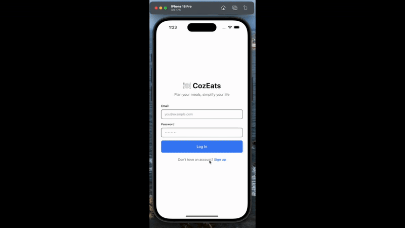
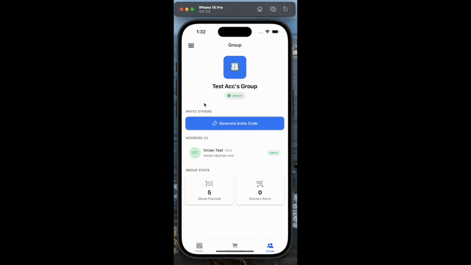
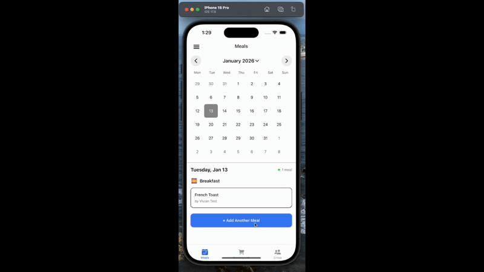
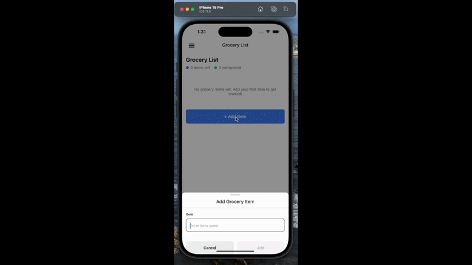

# 🍽️ CozEats

**Plan your meals, simplify your life**

CozEats is a collaborative meal planning and grocery list app designed for groups, families, or roommates. Coordinate meals, share responsibilities, and keep everyone on the same page with real-time synchronization.

## 📱 Features

### 1. User Features



- **Signup** - Create your account to get started
- **Signin** - Secure authentication for returning users
- **Change Password** - Update your password anytime
- **Update User Name** - Personalize your profile

### 2. Group Features



- **Create Group** - Start a new meal planning group
- **Invite Others** - Generate invite codes to add members
- **Join Group** - Use an invite code to join existing groups

### 3. Meals Feature



- **Meal Categories** - Organize by Breakfast, Lunch, and Dinner
- **Display Creator** - See which member is responsible for each meal
- **Calendar View** - Plan meals by date
- **Long Press for Deletion** - Easy meal removal
- **Create Meal** - Add new meals with details

### 4. Grocery List



- **Sync Grocery List** - Real-time updates for all group members
- **Track Buying Status** - Know what's already been purchased
- **Complete Status Sync** - Check off items as you shop
- **Delete All Feature** - Quick list cleanup
- **Delete Item** - Remove individual items

### 5. Settings

- **Theme Color** - Customize your app appearance

## 🚀 Getting Started

### Prerequisites

- Node.js (v16 or higher)
- npm or yarn
- Expo CLI
- iOS Simulator or Android Emulator (or Expo Go app on your device)

### Installation

1. Clone the repository:
```bash
git clone https://github.com/YuJieWu5/cozeats.git
cd cozeats
```

2. Install dependencies:
```bash
npm install
```

3. Start the development server:
```bash
npx expo start
```

4. Run on your device:
   - Press `i` for iOS simulator
   - Press `a` for Android emulator
   - Scan the QR code with Expo Go app on your phone

## 🛠️ Tech Stack

- **React Native** - Mobile framework
- **Expo** - Development platform
- **TypeScript** - Type safety
- **NativeWind** - Tailwind CSS for React Native
- **Expo Router** - File-based navigation
- **AsyncStorage** - Local data persistence

## 📁 Project Structure

```
cozeats/
├── app/                    # Screen components
│   ├── (tabs)/            # Tab navigation screens
│   ├── index.tsx          # Login screen
│   ├── signup.tsx         # Signup screen
│   └── profile.tsx        # Profile screen
├── components/            # Reusable components
│   ├── ui/               # UI components
│   └── ...               # Feature-specific components
├── lib/                  # Utilities and context
│   ├── api.ts           # API functions
│   ├── auth-context.tsx # Authentication context
│   └── theme-context.tsx # Theme management
└── assets/              # Images and static files
```

## 🔮 Future Features

- 🔔 **Notifications** - Reminders to prepare meals
- 🖼️ **Group Image** - Customize your group with photos
- 🚪 **Leave Group** - Exit groups you no longer need
- ❌ **Delete Group** - Remove groups you created
- 👤 **User Image** - Add profile pictures

## 📄 License

This project is licensed under the MIT License - see the [LICENSE](LICENSE) file for details.

## 🤝 Contributing

Contributions, issues, and feature requests are welcome!

## 📧 Contact

For questions or support, please open an issue on GitHub.

---

Made with ❤️ by Vivian Wu
